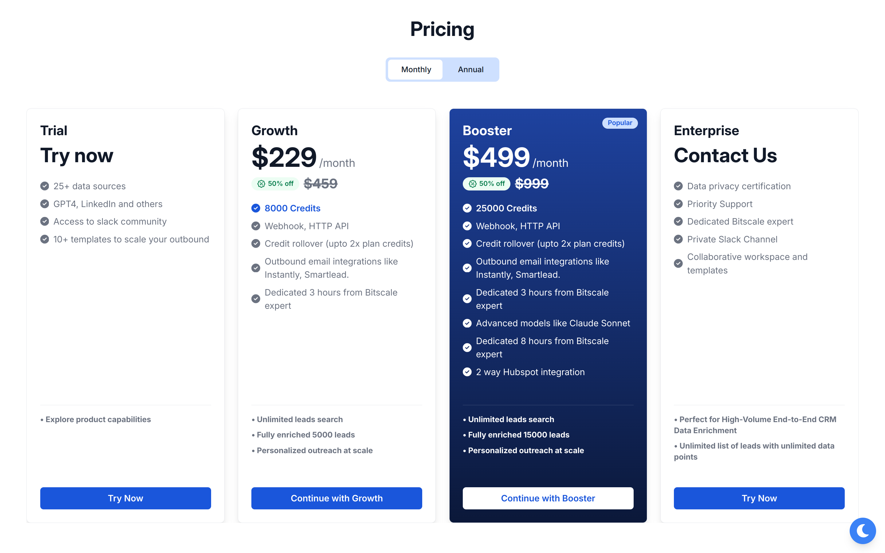
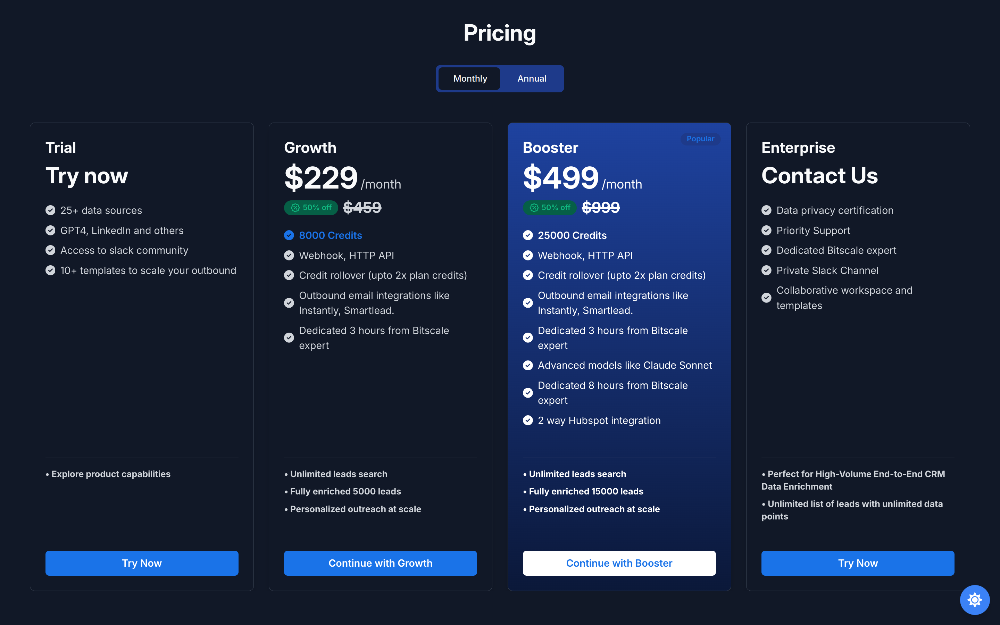
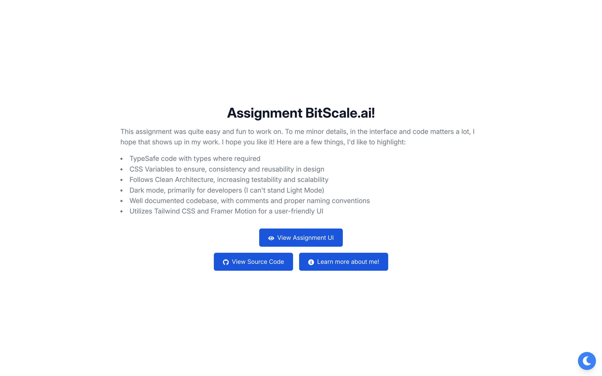
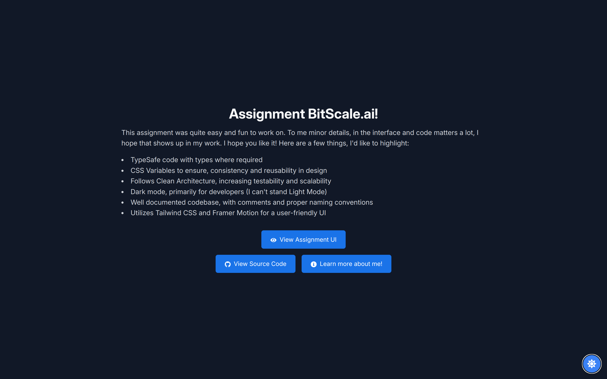

## BitScale Internship Assesment


This assignment was quite easy and fun to work on. To me minor details,
in the interface and code matters a lot, I hope that shows up in my
work. I hope you like it! Here are a few things, I'd like to highlight:
<ul>
    <li>TypeSafe code with types where required</li>
    <li>CSS Variables to ensure, consistency and reusability in design</li>
    <li>Follows Clean Architecture, increasing testability and scalability</li>
    <li>Dark mode, primarily for developers (I can't stand Light Mode)</li>
    <li>Well documented codebase, with comments and proper naming conventions</li>
    <li> Utilizes Tailwind CSS and Framer Motion for a user-friendly UI</li>
</ul>


## Screenshots 🖥️📱

### Pricing Page (/pricing)



### Home Page (/)

<div style="display: flex; justify-content: space-around;">
  
  
</div>

## Project Structure 

```
src/
│ 
├── pages/
│   ├── pricing/
│   │   ├── presentation/
│   │   │   └── Pricing.tsx #Root layout for pricing page
│   │   │   └── components/
│   │   │        ├── pricingCard.tsx #Component for pricing card
│   │   │        └── tabBar.tsx #The montly/annually tabbar
│   │   └── application/ 
│   │       └── data.ts #Contains pricing cards data
│   ├── home/
│   │   └── presentation/ 
│   │        └── Home.tsx #Basic landing layout & action buttons
├── types/
│   └── pages/
│       └── pricing.ts #Types for Pricing component
├──  lib/
│   └── utils.ts #Entails utils (currently cn())
├── App.tsx
├── index.css 
├── main.tsx
└── ...
```
